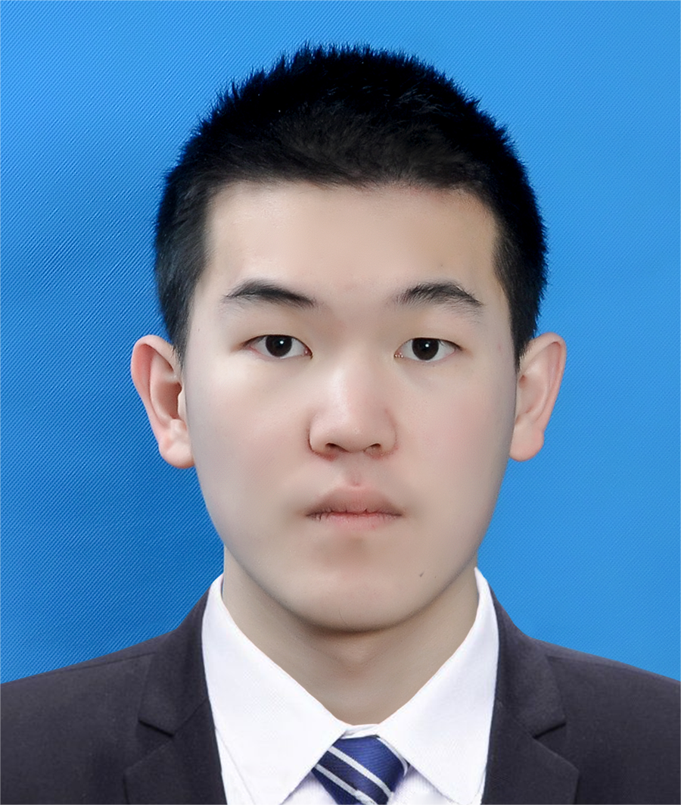

<table style="border: none; width: 100%;">
<tr style="border: none;">
<td style="width: 70%; vertical-align: top; border: none;">

# About Me

I am an incoming Ph.D. student in the [Department of Computer Science and Engineering (CSE)](https://www.cse.cuhk.edu.hk/) at [The Chinese University of Hong Kong (CUHK)](https://www.cuhk.edu.hk/chinese/index.html), under the supervision of Prof. [John C.S. Lui](https://www.cse.cuhk.edu.hk/~cslui/). Before this, I earned a B.Sc. from the Advanced Class in Mathematics and Physics for Information Science at Huazhong University of Science and Technology (HUST). My current academic interests focus on **Online Learning** and **Large Language Model (LLM)**. As an amateur enthusiast in mathematics, I am particularly keen on exploring the mathematical aspects of LLMs. I am always open to potential collaborations, so please feel free to reach out.

[Email](zeyuzhangzyz@gmail.com)&nbsp;&nbsp;&nbsp;   /  &nbsp;&nbsp;&nbsp;    [CV](resume.pdf)&nbsp;&nbsp;&nbsp;    /    &nbsp;&nbsp;&nbsp; [Github](https://github.com/zeyuzhangzyz)  &nbsp;&nbsp;&nbsp; /  &nbsp;&nbsp;&nbsp; [Wechat](wechat.png)   &nbsp;&nbsp;&nbsp; 

</td>
<td style="width: 30%; vertical-align: middle; text-align: center; border: none;">

</td>
</tr>
</table>

# Publications 

- Xiangxiang Dai, **Zeyu Zhang**, Peng Yang, Yuedong Xu, Xutong Liu, John C.S. Lui, "AxiomVision: Accuracy-Guaranteed Adaptive Visual Model Selection for Perspective-Aware Video Analytics", accepted in the 32nd ACM Multimedia Conference (MM), 2024. (1149/4385 = 26.2%, CCF A)

- Chuqin Zhou, Peng Yang, **Zeyu Zhang**, Chengzhi Wang, Ning Zhang, "Bandwidth-Efficient Edge Video Analytics via Frame Partitioning and Quantization Optimization", accepted in the IEEE International Conference on Communications (ICC), 2023.

  

​                        

# Awards

- National Scholarship (Oct. 2021, Oct. 2023)  
 (Top 2% - Highest honor for undergraduates in China.)

- Merit Student (Oct. 2021, Oct. 2023)  
  (Top 5% - Recognized as an excellent student at our university.)

- Outstanding Undergraduates in Term of Academic Performance (Oct. 2021)  
  (Top 1% - Highest honor for undergraduates at HUST.)

- Top 1% in Alibaba Global Mathematics Competition (Apr. 2022).

- *The first prize* in the 13th Mathematics Competition for Chinese University Students (Dec. 2021).

- *The second prize* in Interdisciplinary Contest in Modeling (ICM) (Jun. 2022).

- *The second prize* of Hubei Area in National University Mathematical Modeling Competition (Oct. 2022).